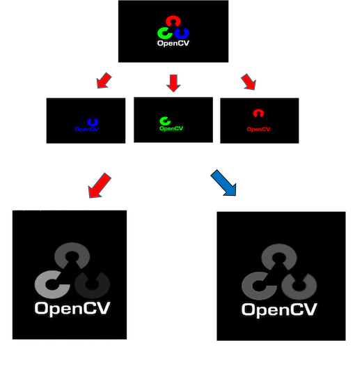
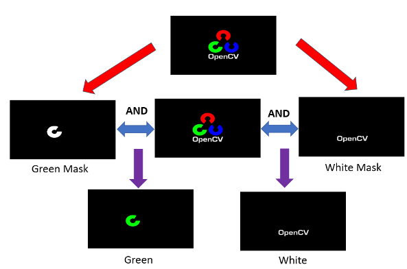

# Computer-Vision Practice

**1.Discription:**

***1. This is just a small project that we want to practice the basic image processing skills for computer vision.***

***2.This topic was focus on image processing over color and used filters to do image smoothing.***

**2.Usage:**

1. Downloads whole repository and change path into the main folder
2. Run `python start.py` .
3. Input the image 1 for feature 1 and image 2 for feature 2.
4. Run the whole code.

**3.Feature:**

1.Image Prcessing

* 1.1 Color Separation :
  
    * Extract 3 channels of the image BGR to 3 separated channels.
      
      
* 1.2 Color Transformation :
  
    * Transform image into grayscale image
    * Merge BGR separated channel images from above problem into grayscale image by average weight : (R+G+B)/3.

      
* 1.3 Color Detection
  
    * Transform [opencv.png](Figures/opencv.png) from BGR format to HSV format.
    * Generate mask by calling : cv2.inRange(hsv_img , lower_bound , upper_bound)
    * Detect Green and White color in the image by calling : cv2.bitwise_and(bgr_img , bgr_img , mask)

     
* 1.4 Blendling
  
   * Here [Dog_Strong.jpg](Figures/Dog_Strong.jpg) and [Dog_Weak.jpg](Figures/Dog_Weak.jpg) to be example

   https://github.com/Kung-hen/Image-processing-and-smooth/assets/95673520/ce2d8d34-6793-4961-8f74-fe055452e71e

    
2.Image Smoothing

* 2.1 Gaussian Blur
   * Apply gaussian filter k x k to input image1.
   * filter kernel equation = (k=2m+1)

https://github.com/Kung-hen/Image-processing-and-smooth/assets/95673520/92b5157a-ce60-4701-bbb1-2a355492ea54

* 2.2 Bilateral fliter
   * Define: Bilateral magnitude 0 ~ 10, sigmaColor = 90 and sigmaSpace = 90. 
   * Apply Bilateral filter k x k to input image1.
   * filter kernel equation = (k=2m+1)
     
https://github.com/Kung-hen/Image-processing-and-smooth/assets/95673520/ba7cc81d-efd2-4800-ba98-c87b61829303

* 2.3 Median fliter
   * Define: Median magnitude 0 ~ 10.
   * Apply Median filter k x k to input image1.
   * filter kernel equation = (k=2m+1)

https://github.com/Kung-hen/Image-processing-and-smooth/assets/95673520/89c4e7a8-0f73-4c8e-bc3d-8f68de7a81d5

