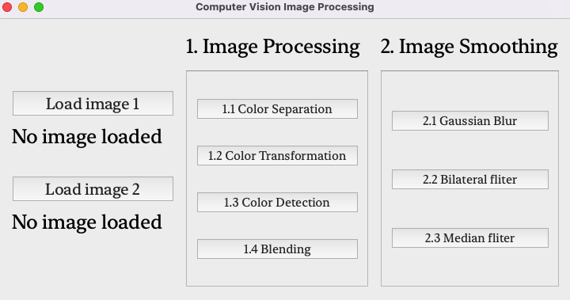
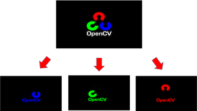

# Computer-Vision Practice

**1.Discription:**

***1. This is just a small project that we want to practice the basic image processing skills for computer vision.***

***2.This topic was focus on image processing over color and used filters to do image smoothing.***

**2.Usage:**

1. Downloads whole repository and change path into the main folder
2. Run "start.py" .
3. Input the image 1 for feature 1 and image 2 for feature 2.
4. Run the whole code.

**3.Feature:**

1.Image Prcessing

* 1.1 Color Separation

* 1.2 Color Transformation
* 1.3 Color Detection
* 1.4 Blendling
    
2.Image Smoothing

* 2.1 Gaussian Blur
* 2.2 Bilateral fliter
* 2.3 Median fliter
